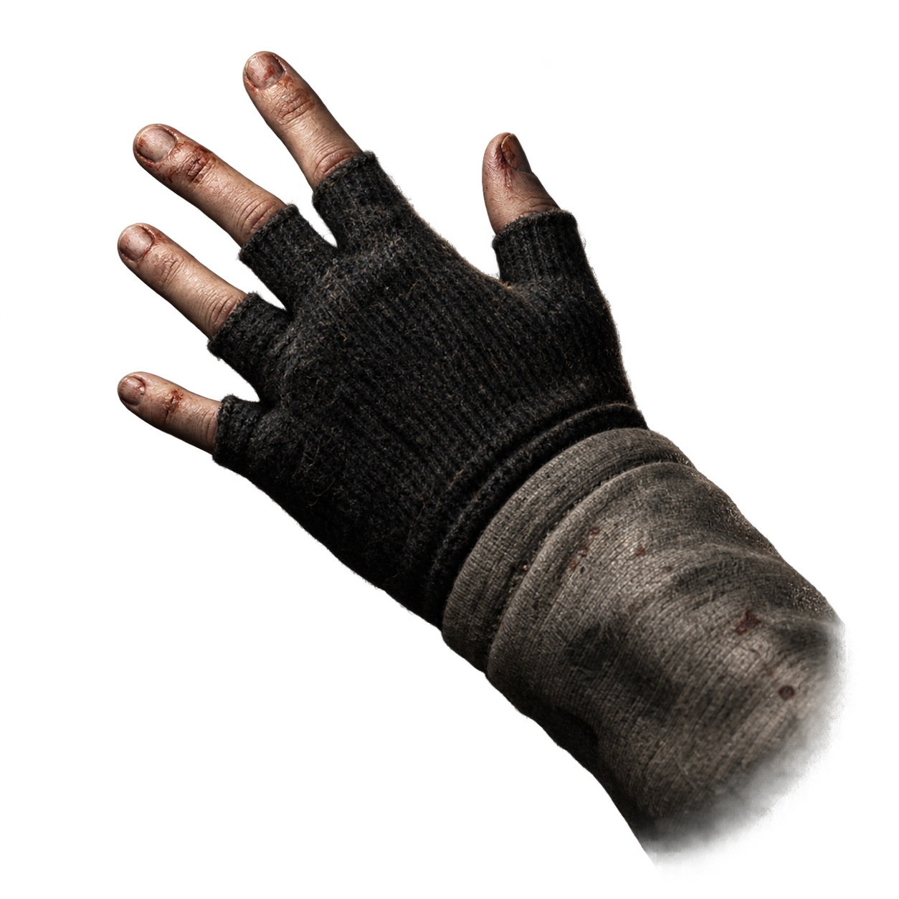

# cof-fix



This repository contains a bounded, opt-in experiment for the original Steam Cry of Fear server and client DLLs on FWGS Xash3D.

The tested engine source is FWGS commit `4857b389e6ba32ddaa68582aedcbc950c138f46a`. The launch dump proves that the original DLL expects `physinfo` and the common playermove callbacks four bytes later than the current engine's `playermove_t`: the current table has `PM_Info_ValueForKey` at `+0x4F554`, while the original PM_Init helper reads its two-argument callback at `+0x4F558`. See [the adapter note](docs/pmove-adapter.md), which records the bounded runtime checkpoints and remaining ABI failure.

`patches/cof-pmove-legacy.patch` adds an experimental `-cof-pmove-legacy` engine option. It copies the native playermove object into a persistent four-byte-shifted view for the original DLL's PM_Init and PM_Move calls, then copies state back. The matching client overlay in `patches/cof-client-pmove-legacy.patch` translates the client DLL's two playermove entrypoints. The entvars and edict overlays are separately opt-in and documented in [the dedicated profile report](docs/dedicated-profile-test.md) and [the stride proposal](docs/edict-stride-proposal.md). These are diagnostic candidates: the historical missing fields are not identified and this is not a release compatibility claim.

The corrected client checkpoint initialized the renderer, menu, and VGUI, loaded `c_intro`, and completed bounded save/load smoke tests with no captured second-chance exception. The save preview was nonblank. This does not establish visual parity, human gameplay, campaign completeness, or Steam Play launch behavior; see [the client startup report](docs/client-pmove-adapter-test.md) and [the campaign/save-load report](docs/campaign-save-load-test.md).

The repo intentionally contains no game files, Steam DLLs, runtime archives, dumps, or built binaries. Build output belongs in the ignored source/build directories.

For reusable engine/game development lessons from this investigation, see the [Xash/GoldSrc developer notes](docs/xash-goldsrc-developer-notes.md).
For the detailed custom CoF UI ownership, coordinate-space, and scaling research, see [the custom UI scaling note](docs/cof-custom-ui-scaling-research.md).
For the disposable-runtime and per-run evidence policy used by isolated
runtime checks, see the [launcher fixture workflow](docs/steam-launch-prototype.md#reusable-fixture-workflow).

## Applying the patch

Use a clean checkout or extracted archive of the pinned FWGS revision and run:

```powershell
pwsh -File .\scripts\apply-pmove-adapter.ps1 -SourceRoot .\xash3d-fwgs-4857b389e6ba32ddaa68582aedcbc950c138f46a
```

For the complete client profile, apply the server adapter first, then the client adapter, entvars profile, and edict stride overlay with their ordered helpers:

```powershell
pwsh -File .\scripts\apply-cof-client-pmove-profile.ps1 -SourceRoot .\xash3d-fwgs-4857b389e6ba32ddaa68582aedcbc950c138f46a
pwsh -File .\scripts\apply-cof-entvars-profile.ps1 -SourceRoot .\xash3d-fwgs-4857b389e6ba32ddaa68582aedcbc950c138f46a
pwsh -File .\scripts\apply-cof-edict-stride-profile.ps1 -SourceRoot .\xash3d-fwgs-4857b389e6ba32ddaa68582aedcbc950c138f46a
```

The source tree must be inside this repository because the scripts scope patch application to the project workspace. Each helper checks concrete source markers after applying and reverse-checks the patch; a successful process exit alone is not evidence that the source changed. They refuse duplicate application and leave generated build output in ignored source/build directories.

The optional CoF save-menu checkpoint has a separate ordered application. Apply
the existing menu-load trace prerequisite and root-save compatibility first,
then the pause list/comment plumbing, server menu backend, client tape-command
hook, and finally the nested MainUI files:

```powershell
pwsh -File .\scripts\apply-cof-menu-load-trace.ps1 -SourceRoot .\xash3d-fwgs-4857b389e6ba32ddaa68582aedcbc950c138f46a
pwsh -File .\scripts\apply-cof-save-root-compat.ps1 -SourceRoot .\xash3d-fwgs-4857b389e6ba32ddaa68582aedcbc950c138f46a
pwsh -File .\scripts\apply-cof-pause-save-plumbing.ps1 -SourceRoot .\xash3d-fwgs-4857b389e6ba32ddaa68582aedcbc950c138f46a
pwsh -File .\scripts\apply-cof-menu-save-backend.ps1 -SourceRoot .\xash3d-fwgs-4857b389e6ba32ddaa68582aedcbc950c138f46a
pwsh -File .\scripts\apply-cof-tape-save-command.ps1 -SourceRoot .\xash3d-fwgs-4857b389e6ba32ddaa68582aedcbc950c138f46a
pwsh -File .\scripts\apply-cof-mainui-menu-save.ps1 -SourceRoot .\xash3d-fwgs-4857b389e6ba32ddaa68582aedcbc950c138f46a
```

The menu backend and nested MainUI integration are both required for a GUI
save action. `cof_save_root_compat` remains an explicit runtime enablement;
`cof_pause_menu_saves` defaults to `0` and is the user's separate menu-save
choice. The implementation shares the original five slots and keeps the tape
save path separate. See [root-save compatibility](docs/cof-save-root-compat.md),
[pause plumbing](docs/cof-pause-save-plumbing.md),
[menu backend](docs/cof-menu-save-backend.md),
[tape command](docs/cof-tape-save-command.md), and
[MainUI integration](docs/cof-mainui-menu-save.md) for scope and validation
limits. These checkpoints are source/apply experiments; runtime menu-save
success and visual parity are not implied.

The renderer fix for the missing Cry of Fear main-menu skyline is applied after
the GL stage, solid-entity, and transparent-triangle trace patches:

```powershell
pwsh -File .\scripts\apply-cof-custom-renderfx-opaque.ps1 -SourceRoot .\xash3d-fwgs-4857b389e6ba32ddaa68582aedcbc950c138f46a
```

It restores GoldSrc's rule that `rendermode`-normal entities stay opaque
whatever their `renderfx` is, behind the `cof_custom_renderfx_opaque` cvar
(default `1`). See [custom renderfx opaque classification](docs/cof-custom-renderfx-opaque.md)
for the root cause, the measured evidence, and the validation.

Milestone 1 of the unified UI stack is the engine-side input and paint gate. It
is applied after the engine save/menu patches above; it is independent of the
`ref/gl` patches and may be applied before or after them:

```powershell
pwsh -File .\scripts\apply-cof-ui-input-gate.ps1 -SourceRoot .\xash3d-fwgs-4857b389e6ba32ddaa68582aedcbc950c138f46a
```

With `cof_ui_input_gate 1` (default) the Cry of Fear client neither paints its
VGUI/HUD layer nor receives keyboard and mouse input while the engine menu, the
console or the chat line has focus, and `Escape` always reaches `CL_Escape_f` so
the engine menu opens even while a CoF VGUI panel is up. Game focus is
unchanged. The patch also packages the previously untracked
`cof_skip_client_hud_redraw` and `cof_skip_vgui_paint` diagnostics (both default
`0`).

The same patch carries the sibling cvar `cof_ui_deferred_cmd_guard` (default
`1`). Cry of Fear's `HUD_Init` issues `map c_game_menu1` before the engine is
initialised, so the engine parks it in `host.deferred_cmd` and replays it the
first frame the engine menu becomes visible: from gameplay that threw the loaded
save away, and on a plain boot it replaced MainUI's `map_background` with a real
map. The guard drops that stale boot command instead and reports it once at
developer level. Setting the cvar to `0` restores the stock path and reproduces
both effects. See [unified UI input gate](docs/cof-ui-input-gate.md) for the
design, the disassembly and log evidence, and the limits.

A video mode change made from the menu used to strip the Cry of Fear background
scene - custom sky, atmosphere and snow gone, the map's plain `blue22` skybox
left behind - because FWGS keeps the GL context and only re-calls the client's
`pfnVidInit`, which in this client is a per-level entry point whose one-shot
setup nothing replays. The fix is applied after the input gate:

```powershell
pwsh -File .\scripts\apply-cof-vid-restart-background.ps1 -SourceRoot .\xash3d-fwgs-4857b389e6ba32ddaa68582aedcbc950c138f46a
```

With `cof_vid_restart_background 1` (default) a completed resolution change or
windowed/fullscreen toggle restarts the menu background map through the command
buffer, so the client's per-level init reruns and the scene comes back whole.
A real game in progress is never reloaded: the engine prints a one-line
developer notice instead, which is the hook for a later fix. The sibling cvar
`cof_vid_skip_redundant_vidinit` (default `0`, off) skips the client
`pfnVidInit` outright when the render size did not change, which is the cheaper
repair for a pure fullscreen toggle; it is off because it has only been
exercised on SDL2 + `ref_gl` on Windows. See
[video mode changes and the menu scene](docs/cof-vid-restart-background.md) for
the root cause, the measured A/B and the limits.

Cry of Fear's main menu is a client VGUI panel that lives on the real map
`c_game_menu1`, so "back to the main menu" is spelled `map c_game_menu1`
everywhere in the game: by the client's `to3dmenu` command and by its
Unlockables, difficulty and server-settings panels through `pfnClientCmd`, and
by `hl.dll` after deaths, endings and the `closegame` teardown through
`CLIENT_COMMAND`, which arrives as an `svc_stufftext`. Under the unified UI that
brought the *old* Cry of Fear menu back - the reported symptom was the
Unlockables gallery's MAIN MENU button. The redirect is applied after the input
gate, the video-mode background restart and the menu-load trace, whose lines it
uses as hunk context:

```powershell
pwsh -File .\scripts\apply-cof-ui-menu-map-redirect.ps1 -SourceRoot .\xash3d-fwgs-4857b389e6ba32ddaa68582aedcbc950c138f46a
```

With `cof_ui_menu_map_redirect 1` (default) the engine answers any of those with
the sequence MainUI's own Quit-to-menu path produces - `disconnect`, then
`menu_main`, then `map_background` of the scene from
`scripts/chapterbackgrounds.txt` - and prints one developer line naming the
producer. `map_background` itself is untouched, so the background map still
works and the redirect cannot recurse. Setting the cvar to `0` restores the
stock path and reproduces the old behaviour in the same binary. See
[menu-map redirect](docs/cof-ui-menu-map-redirect.md) for the disassembly of
every producer, the interception points, the measured runs and the limits.

Dying was the other place the old Cry of Fear UI came back: the game DLL puts up
a `GAME OVER` panel with `LOAD GAME` and `EXIT` links, and `EXIT` then reached
the old menu. Measured, that screen is not a command and not a level change at
all - it is the user message `VGUIMenu` with a first byte of 35, which
`client.dll`'s `CClientViewport::ShowVGUIMenu` turns into its `CGameOver` panel,
and nothing follows it. The engine now catches that message and opens its own
death page instead. The same patch adds `con_enable`, the archived cvar stock
FWGS does not have, so "Enable console" can be a real checkbox rather than the
one-way `ui_allowconsole` button. It is applied after the menu-map redirect, the
input gate and the styled console:

```powershell
pwsh -File .\scripts\apply-cof-ui-death-flow.ps1 -SourceRoot .\xash3d-fwgs-4857b389e6ba32ddaa68582aedcbc950c138f46a
```

With `cof_ui_death_menu 1` (default) death brings up `GAME OVER` in the theme's
wordmark over the untouched scene - no panel, no scrim - with `Load Game` (our
save list, whose Cancel comes back to it, as the original's did) and `Exit`
(the original link's own `map c_game_menu1`, which the redirect turns into
disconnect plus background map). The client's panel is still sent the message
and is simply never painted, because `cof_ui_input_gate` owns the client layer
while a menu page is up. `cof_ui_death_menu 0` reproduces the stock flow in the
same binary. See [the death flow](docs/cof-ui-death-flow.md) for the
disassembly, the measured message trace and timings, the button end states, and
the console cvar.

Milestone 3 part (b) of the unified UI stack turns the engine console into a
Source-style window while keeping every bit of its GoldSrc behaviour. It is
applied after the console variable-width font fallback, whose lines it uses as
hunk context:

```powershell
pwsh -File .\scripts\apply-cof-console-style.ps1 -SourceRoot .\xash3d-fwgs-4857b389e6ba32ddaa68582aedcbc950c138f46a
```

With `cof_console_style 1` (default) the console is a centred translucent panel
of `cof_console_width` x `cof_console_height` of the screen (0.70 x 0.60), with
a hairline border, a title band carrying `CONSOLE` and the build string, a
clickable close `X`, and a separate input box with its own border and caret.
The geometry is derived from the render size and the font, with none of the
stock path's hardcoded 4:3 math. The tilde toggle, key handling, history,
completion, backscroll and the notify area are untouched code, and
`cof_console_style 0` reaches the stock drawing unchanged. Panel colours follow
the milestone-3a theme spec and are exposed as `cof_console_*_color` cvars.
`cof_console_font_grayscale` (default `1`, only honoured while the style is on)
loads the console font as luminance, because Cry of Fear's own `CONCHARS` atlas
is orange and would otherwise tint every colour the console draws. See
[the console as a Source-style window](docs/cof-console-style.md) for the
measured colours, the geometry, the screenshot matrix and the limits.

A separate one-function crash fix came out of the same work: `newgame` typed at
the console while the menu background map runs shuts the server down, and the
levelshot queued by the next level load then ran with no world and dereferenced
a null path in `FS_FixFileCase`. It shares no hunk context with anything else
and can be applied in any order:

```powershell
pwsh -File .\scripts\apply-cof-levelshot-guard.ps1 -SourceRoot .\xash3d-fwgs-4857b389e6ba32ddaa68582aedcbc950c138f46a
```

See [levelshot NULL-world guard](docs/cof-levelshot-guard.md) for the measured
stack and the verification run.

The first milestone of the unified UI stack puts the engine menu on screen over
the live Cry of Fear scene. It is one small MainUI change plus game-directory
data files:

```powershell
pwsh -File .\scripts\apply-cof-mainui-background-scrim.ps1 -SourceRoot .\xash3d-fwgs-4857b389e6ba32ddaa68582aedcbc950c138f46a
```

The patch makes the in-game menu background a translucent scrim instead of an
opaque fill while `ui_renderworld` is on, behind the new `ui_scrim_alpha` cvar
(default `150`, `255` reproduces the previous behaviour). The data files that
go with it live in [`gamedata/`](gamedata/README.md), which is an overlay for a
runtime's `cryoffear/` folder and contains no game assets. See
[UI milestone 1 plumbing](docs/cof-ui-m1-plumbing.md) for what was verified,
the Cry of Fear menu-map command table, and the font-backend finding.

The second milestone makes that engine menu *be* Cry of Fear's menu. It is one
more MainUI patch, applied after the two above:

```powershell
pwsh -File .\scripts\apply-cof-mainui-cof-menu.ps1 -SourceRoot .\xash3d-fwgs-4857b389e6ba32ddaa68582aedcbc950c138f46a
```

The main menu becomes New Game, Load Game, Custom Campaign, Join Server, Host
Server, Language, Unlockables, Extras, Options, Quit - and, in game, Resume,
Save\Load Game, Options, Quit to menu, Quit. New Game opens a Cry of Fear
difficulty page that forwards the game DLL's own `cmd skillset 1..4` to the
live background-map server, so the original white fade and `c_intro` start
happen for real; Custom Campaign lists `maps/*.custom` and prefixes
`cmd campaign <firstmap>`; Language sends `cmd subtitleset 1..7`; Unlockables
opens an engine-menu list of the 27 items with a button that still runs the
client's `unlockablescmd` gallery; Extras opens the original links with
`ShellExecute` instead of the Steam overlay the game used, with
`Cry of Fear: Enhanced` (<https://cofenhanced.haej.pl>) added as its first
entry. The two white
squares that used to sit in the top-right corner were MainUI's minimize and
close bitmaps with no `gfx/shell` artwork behind them; they are gone. Only the
`cryoffear` game directory is affected - every other game keeps the stock menu.
See [UI milestone 2](docs/cof-ui-m2-cof-menu.md) for the measured command
table, the evidence and the open items.

The third milestone gives that menu one minimalist Source-era look. It is one
more MainUI patch, applied after the three above:

```powershell
pwsh -File .\scripts\apply-cof-mainui-source-theme.ps1 -SourceRoot .\xash3d-fwgs-4857b389e6ba32ddaa68582aedcbc950c138f46a
```

Dialogs become centred translucent dark-grey panels with a thin border, an
uppercase title band, a close X and an OK/Cancel row bottom-right; the main
menu becomes a centred plain-text list under a `CRY OF FEAR` / `ENHANCED` text
wordmark, and the pause menu a lower-left list over the scrim. Checkboxes,
sliders, spinner arrows, table arrows, drop-down arrows and the close X are
drawn from primitives, so nothing depends on the `gfx/shell` artwork Cry of
Fear does not ship, and the library-wide 4-unit scaled outline becomes a
hairline. Type is Inter (SIL Open Font License 1.1) read from
`cryoffear/gfx/fonts/` through stb_truetype - configure the menu with
`--enable-stbtt` - with a GDI fallback chain so a missing file can never drop
the menu to the bitmap font. The whole theme is behind the archived cvar
`ui_theme` (default `1`; `0` restores the upstream WON look). The same patch
carries one functional fix: the menu now issues the client's own `stopmp3`
before a Cry of Fear save load or a new game, which the original client panels
did and the engine menu did not. See
[UI milestone 3a](docs/cof-ui-m3-theme.md) for the palette, the per-dialog
layouts, the screenshots and the open items.

A feedback round on that milestone (same patch, same apply script) reshapes the
options tree and fixes what the first deployed build got wrong. Options is now
**Game, Controls, Audio, Video**: *Game* is a new top-level page holding what
used to be hidden behind Controls > Advanced, plus the pause-menu-saves switch
that used to live in the Save/Load menu and a subtitle-language selector, and
the *Adv. Controls* button is gone from Controls; *Video* is one page instead
of a hub with two children, with renderer, window mode, V-sync and the
resolution list on the left, gamma, brightness and the image checkboxes on the
right and a single Cancel/Apply row that keeps FWGS's test-mode and
restart-required semantics; *Audio* drops the HEV suit volume, which Cry of
Fear has no suit for. Message boxes wrap their text and size the panel to it,
the Controls list draws `kb_act.lst` section rules as real section captions
instead of rows of `=`, hover follows the pointer rather than the list cursor,
and the first Cry of Fear run of a build that knows about it turns
`ui_renderworld` on once (recorded in the archived `ui_cof_scene_defaults`) so
the paused scene shows through the pause scrim; a later change by the user is
kept.

A death-flow round (still the same patch and apply script) adds two more things:
`CMenuCoFDeath`, the `GAME OVER` page the engine's `cof_ui_death_menu` hook
opens - the one page drawn with no panel and no scrim, so the scene the player
died in stays exactly as it was - and an **Enable console** checkbox on the Game
page, bound to the new archived engine cvar `con_enable`. Both are documented in
[the death flow](docs/cof-ui-death-flow.md).

The upstream Windows build requires the recursive dependencies and an SDL2 Visual Studio development package for a client build. The isolated client build attempt used the official SDL2 `2.30.9-VC` package (SHA-256 `8C91D91E5BCB997D062EC2B553C53832EBF95654D4AA35E8C02A954D4CE752AE`). Visual Studio 2022 BuildTools with Win32 tools and Windows SDK 10.0.26100 are installed on the research host. A dedicated x86 compile of the patched source completed locally; this repository does not provide a dependency lockfile or reproducible build script, and that artifact is not committed.
